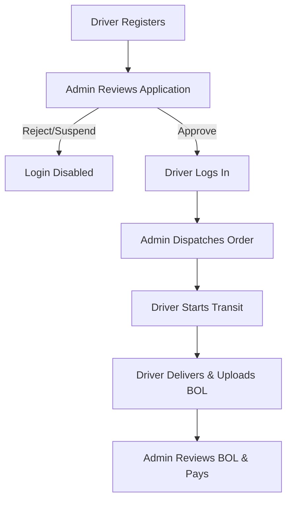

# Client Documentation: Dispatch Now Logistics Portal

Welcome to the **Dispatch Now** Logistics Portal. This guide provides a detailed, comprehensive walkthrough of the platform's features, visual dashboards, system workflows, security protections, and operational instructions.

---

## 1. System Overview

**Dispatch Now** is a modern, high-performance freight dispatching and driver management portal. It connects logistics dispatchers (Administrators) with independent truck drivers (Carriers) to assign loads, track status in real time, upload delivery proofs, and manage factoring payments securely.

The platform is divided into two primary interfaces:
1. **The Administrator Portal**: For logistics dispatchers to register drivers, approve credentials, dispatch freight orders, verify delivery documents, and release payments.
2. **The Driver/Carrier Portal**: For truck drivers to view active loads, update transit statuses, upload compliance documents, track their earnings, and upload Bills of Lading (BOL).

---

## 2. Key System Workflows

The system follows a strict, sequential workflow to ensure logistics coordinator control and compliance safety:

### Phase 1: Driver Registration
1. **How to Register**: A new driver can apply either via the dedicated registration page (`/register/carrier`) or directly through the "Apply Now" registration form in the homepage contact drawers.
2. **Input Fields**: The driver must provide:
   * First Name & Last Name
   * Email Address (unique identifier)
   * Phone Number
   * **Truck Plate Number** (used as their login ID)
   * Driver License Number
   * Primary Equipment Type (Dry Van, Flatbed, Reefer, Box Truck, or Hotshot)
   * Account Password
3. **Mandatory Compliance Uploads**: The driver must upload 5 distinct, high-quality documents:
   * Driver's License Photo
   * Vehicle Cab Registration Document
   * Physical Truck Photo
   * Driver Profile Photo
   * National ID Card
4. **Post-Registration State**: Upon submission, the driver's profile is written to the database with a `'pending'` status. They are redirected to a Thank You screen notifying them that their credentials will grant access once an administrator approves their application.

---

### Phase 2: Administrator Verification & Approval
1. **Carriers Registry**: The Administrator logs into `/admin/carriers` to see all driver applications.
2. **Interactive Document Inspection**:
   * The Admin clicks the **"View Docs"** action button next to a pending driver.
   * An overlay popup modal displays all 5 uploaded compliance files.
   * Clicking **"View File"** opens the document securely in a new browser tab directly from the database, protecting the admin from malicious script execution.
3. **Approval Statuses**:
   * **Approve**: Clicking "Approve" moves the driver's status to `'approved'`. They can now log in immediately.
   * **Suspend**: Clicking "Suspend" moves the driver's status to `'suspended'`. They are instantly logged out, and their portal access is revoked.
   * **Pending**: Default state for new registrations.

---

### Phase 3: Freight Order Creation & Dispatch
1. **Adding an Order**: The Admin navigates to `/admin/add-order`.
2. **Assigning Approved Drivers**:
   * The Admin fills out order details: Customer/Shipper, Pickup/Delivery Address, Pick Date, Weight, Commodity, and Gross Rate.
   * The **"Assign Approved Driver"** dropdown list dynamically displays all *approved* carriers in the database.
   * The options list displays the driver's name alongside their registered **Truck Plate Number** (e.g., `Sarah Mitchell (Truck Plate: TX-9821)`).
3. **Automated Fee Calculation**:
   * The system automatically enforces a **flat 8% dispatch fee**.
   * When the Admin enters a gross rate of `$1,000`, the system automatically calculates:
     * Dispatch Fee (8%): `$80`
     * Driver Payout (92%): `$920`
4. **Order Status**: The newly created order starts in the `'dispatched'` state.

---

### Phase 4: Driver Transit & Real-Time Tracking
1. **Driver Login**: The driver logs into the site using their **Truck Plate Number** (case-insensitive) and password.
2. **Active Load View**:
   * The Driver Portal dashboard displays their active assigned load.
   * The driver sees the shipper, addresses, gross payout (`$920`), and cargo specs.
3. **Status Progression**:
   * The driver toggles the load status sequentially:
     * **`Dispatched`** (Load assigned)
     * **`In Transit`** (Driver is driving to delivery location)
     * **`Delivered`** (Cargo dropped off)
   * The driver updates the status with notes (e.g., *"Heading east on I-80"*), which instantly updates the Admin's All Orders tracking dashboard.

---

### Phase 5: Proof of Delivery (BOL) Submission
1. **Delivered State**: When the driver changes the status to `Delivered`, the portal requests physical verification documents.
2. **Uploading Proofs**:
   * The driver selects and uploads the signed **Bill of Lading (BOL)** document.
   * The driver selects and uploads a **Delivery Photo** showing the cargo at the drop-off site.
3. **Admin Verification**:
   * The Admin views `/admin/orders`. Active and in-progress loads are kept prioritized at the top of the grid.
   * When the BOL/photo are uploaded, a green **"View Proof"** button dynamically appears in the order's row.
   * The Admin clicks the button to open a modal that shows the driver's resolved name, truck plate number, and provides links to view both files.

---

### Phase 6: Factoring & Payment Release
1. **Billing Ledger**: The Admin visits `/admin/payments`.
2. **Payment List**: The ledger lists all delivered dispatches, showing the Driver Name, Truck Plate, Rate, Fee, Payout, and Factoring Status.
3. **Payment Release**:
   * The Admin clicks **"Release Factoring"** once the BOL is checked.
   * The billing state shifts to `'paid'`, and the transaction history is permanently logged.

---

## 3. Dashboard Features & Dynamic Interactions

* **Dynamic Earning Charts**: The Driver Dashboard features a dynamic earnings graph. It aggregates all delivered loads assigned to the driver, groups them by day of delivery, and plots them chronologically. If no loads have been delivered, the chart displays a clean, flat `$0` line.
* **Separated Admin Metrics**: The Admin Dashboard keeps metrics completely distinct:
  * **Registered Shippers**: Computes the count of unique shippers dynamically from all orders.
  * **Registered Carriers**: Displays the count of registered drivers from the database.
* **Universal Login Routing**: A single login form resolves access:
  * If the ID ends with `@dispatchnow.us` or `@dispatchnow`, the system routes to Admin.
  * If the ID is a registered Truck Plate, the system routes to Driver.

---

## 4. Security & Safety Mechanisms

The portal has been secured against industry vulnerabilities:
1. **Brute-Force Protection**: 5 consecutive failed login attempts locks the credentials for **60 seconds**, displaying a live, active countdown.
2. **SQL / NoSQL Injection Immunity**: The database uses memory-safe native JavaScript array lookups.
3. **Remote Code Execution (RCE) Defense**: Uploaded files have their file signatures verified against magic bytes. The files are converted to Base64 inside `db.json` and deleted from disk immediately.
4. **Sandboxed File Delivery**: Dynamic document routes set strict `X-Content-Type-Options: nosniff` and `Content-Security-Policy: default-src 'none'; sandbox;` headers, preventing executable code or malicious scripts from running.
